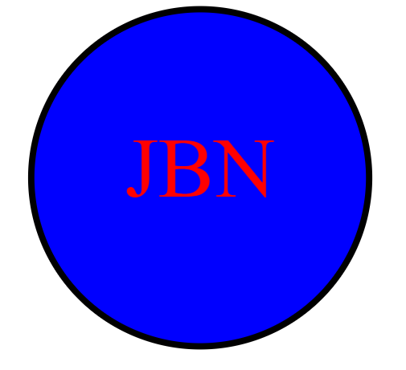

# SVG Logo Maker

This Node.js command-line application generates a logo and saves it as an SVG file. The application prompts the user to select a color and shape, provide text for the logo, and save the generated SVG.

## Installation

To install the necessary dependencies, run the following commands: npm install jest fs --save and npm install inquirer@8.2.4

This will install all the dependencies listed in the `package.json` file.

## Usage

After cloning the repository and installing the dependencies, you can run the application with: node index.js

The application will prompt you for the following inputs:

1. A text for the logo (up to three characters)
2. The color of the text (a color keyword or a hexadecimal number)
3. The shape of the logo (circle, triangle, or square)
4. The color of the shape (a color keyword or a hexadecimal number)

After receiving all the inputs, it will generate an SVG file named `logo.svg` and print "Generated logo.svg" in the command line.

## Testing

To run the unit tests for this application, run the following command: npx jest

This will run the tests in the `test` directory.

## Walkthrough Video

A walkthrough video demonstrating the functionality of the application can be found at [Video Link](https://youtu.be/UelwwLbQcZ4).

## Technologies Used

- Node.js
- Inquirer.js
- Jest

## License

This project is licensed under the MIT license.

